# Swagger Documentation and GraphQL Documentation

## DataBase H2 :

### Test DB connection :
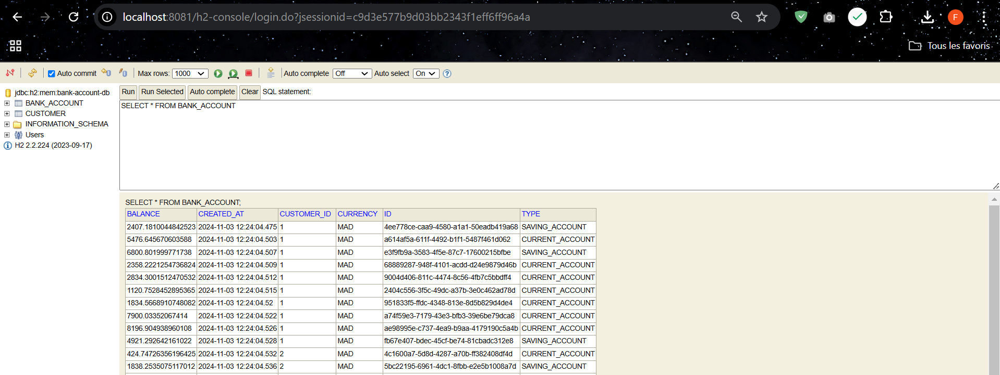

## Swagger Documentation using :

### Get Accounts :
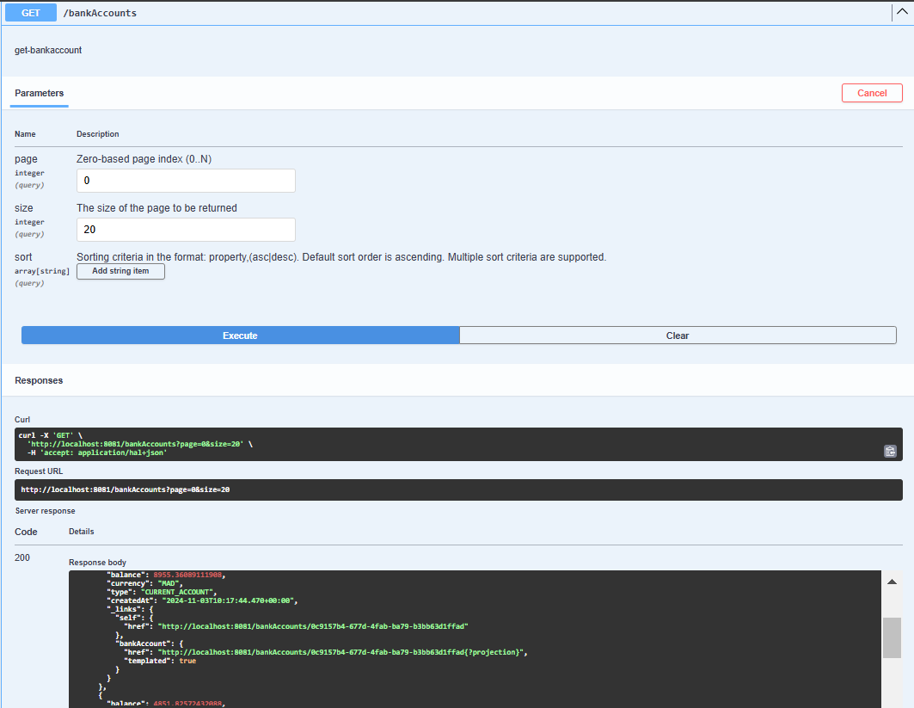

### Get Account :
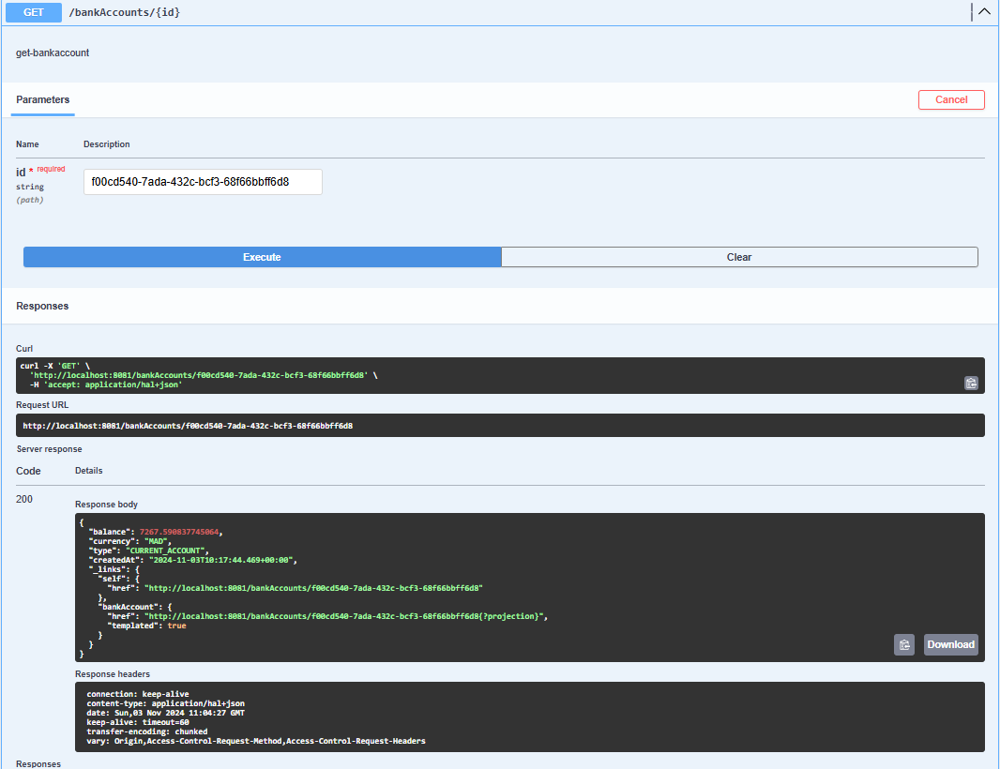

### Get Accounts By type :
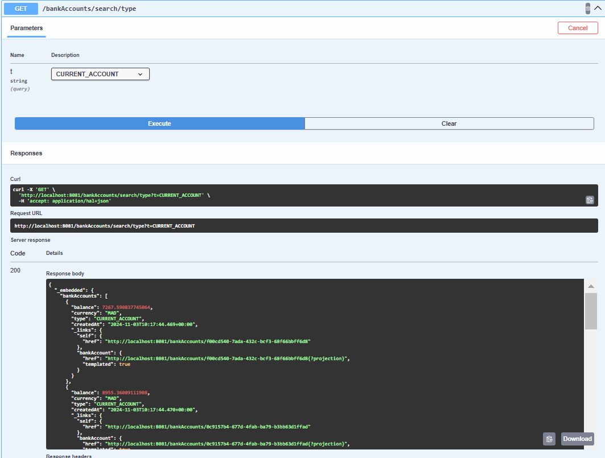

### Save Account :
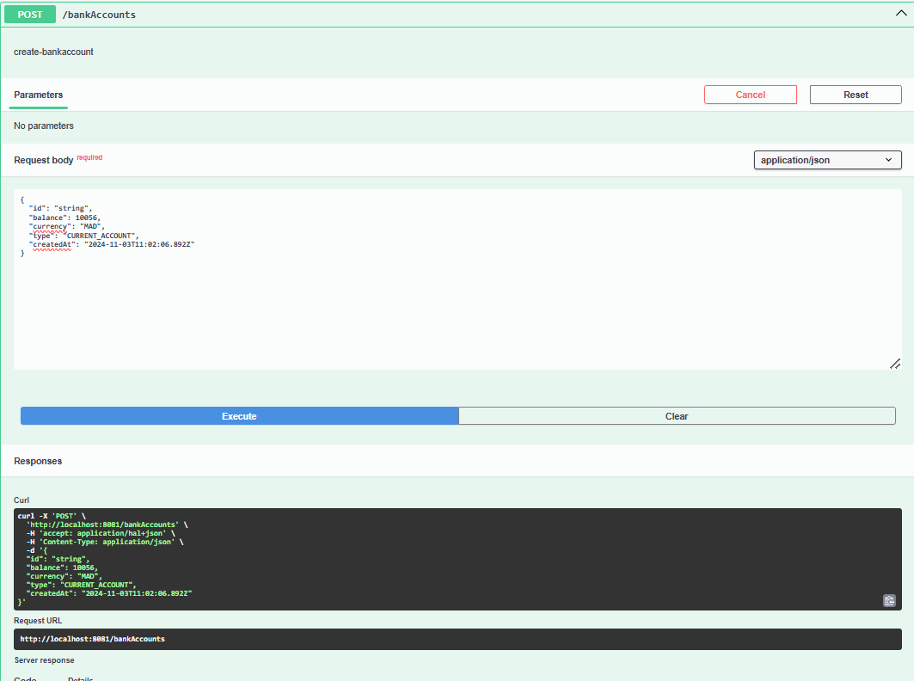
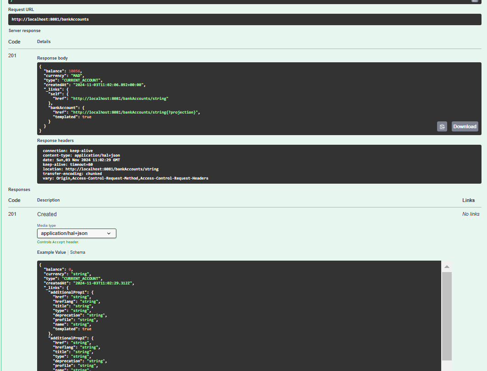

## GraphQL :

### get Accounts :
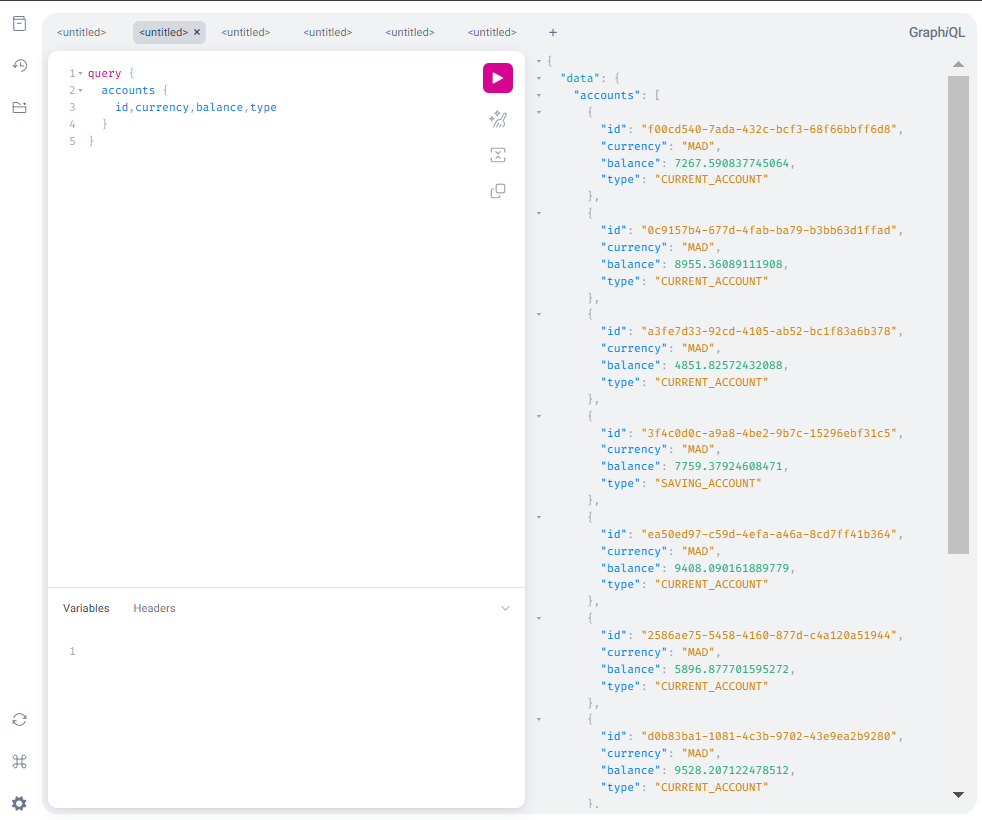

### get Account By ID :
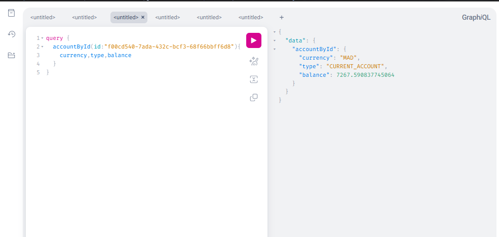

### Account Not Found :
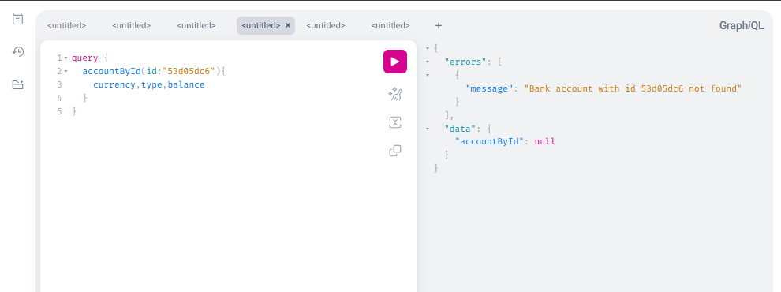

### save Account :
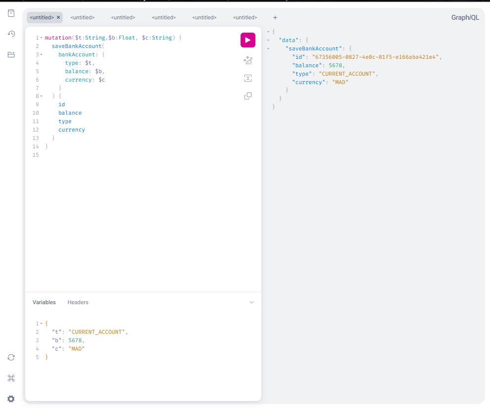

### update Account :
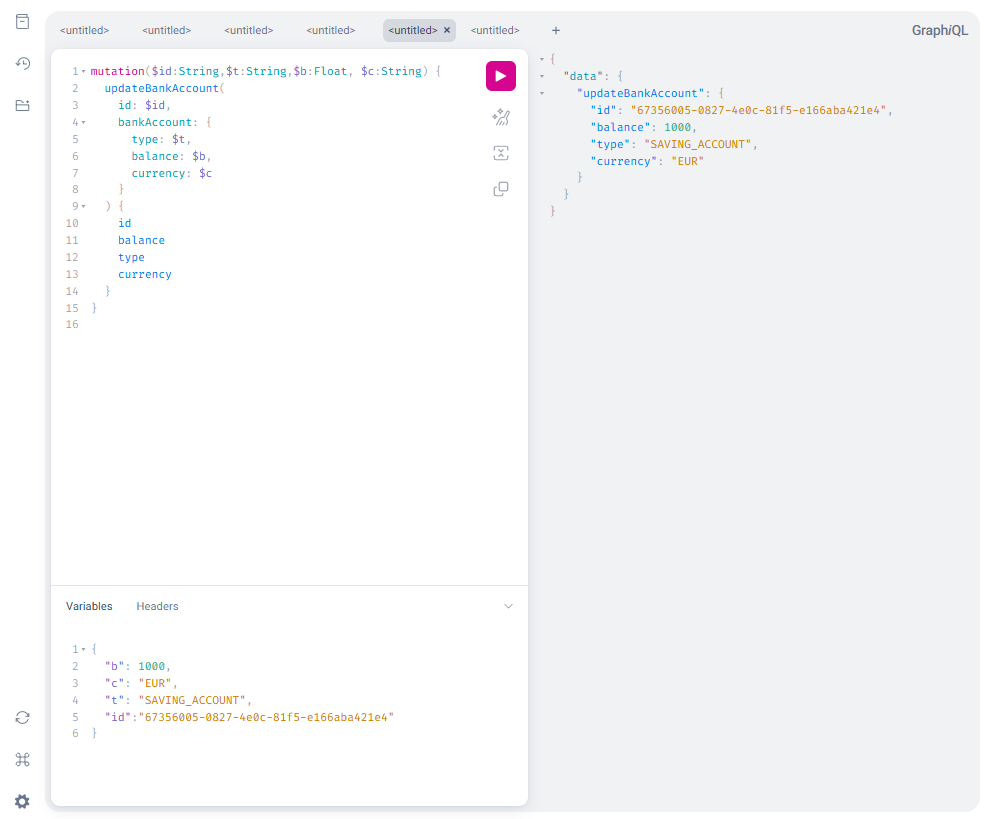

### delete Account :
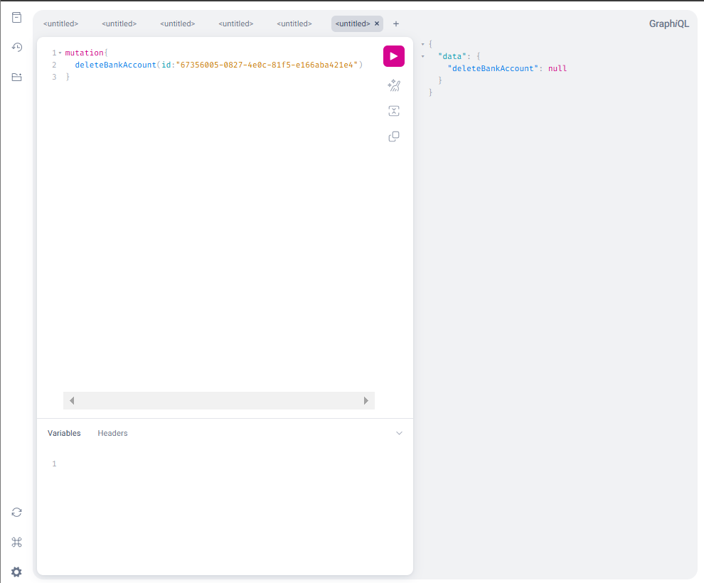

### get Customers with accounts :
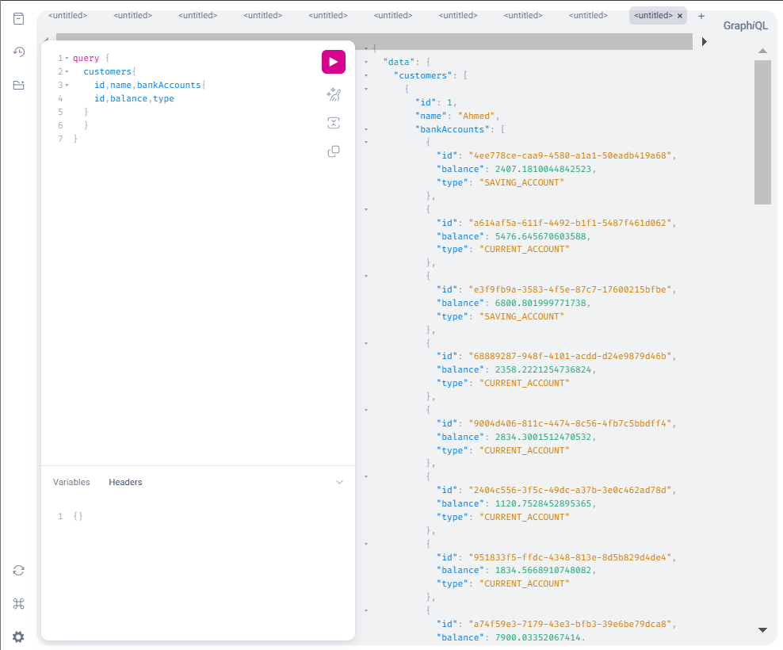

